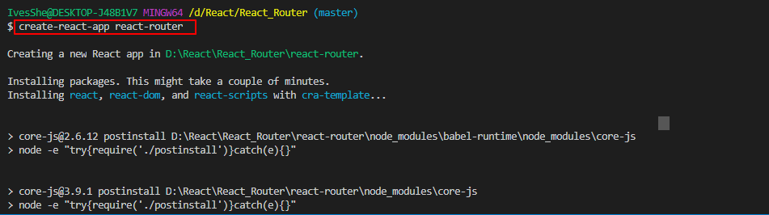
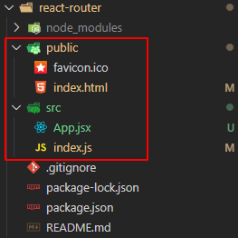
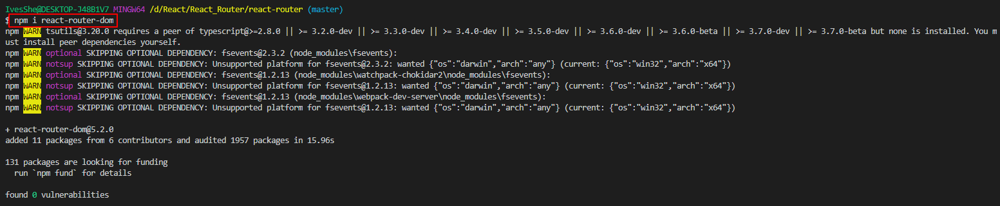
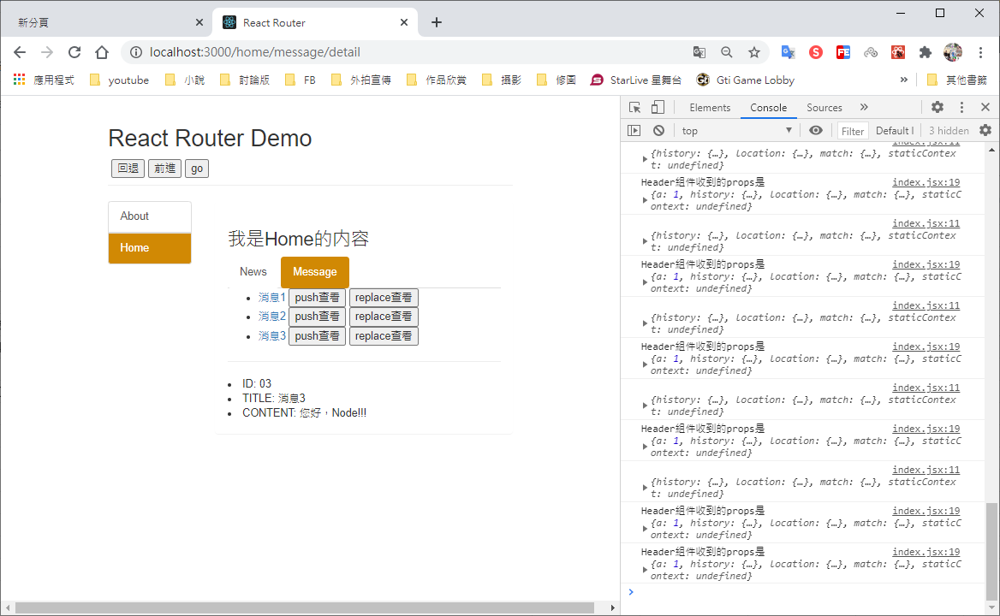

# React Router 和 SPA

# SPA的理解

1. 單頁Web應用(single page web application,SPA)
2. 整個應用只有一個完整的頁面
3. 點擊頁面中的鏈接不會刷新頁面，只會作頁面的局部更新
4. 數據都需要通過ajax請求獲取，並在前端異步展現

# 路由的理解

- 一個路由就是一個映射關係(key:value)
- key為路徑，value可能是function或component
 # 路由的分類

1. 後端路由
    - 理解：value是function，用於處理客戶端提交的請求
    - 註冊路由：router.get(path,function(req,res))
    - 工作過程：當nodejs接收到一個請求時，根據請求路徑找到匹配的路由，調用路由中的函數來處理請求，返回響應數據
2. 前端路由
    - 瀏覽器端路由：value是component，用於展示頁面內容
    - 註冊路由：<Route path="/test" component={Test}>
    - 工作過程：當瀏覽器的path變為/test時，當前路由組件就會變成Test組件


# 路由的基本使用

1. 明確好界面的導航區、展示區
2. 導航區的a標籤改為Link標籤
    ```jsx
    <Link to='/xxxx' component={Demo} />
    ```
3. 展示區寫Route標籤進行路徑的匹配
    ```jsx
    <Route path='/xxxx' component={Demo} />    
    ```    
4. 
    ```jsx 
    <App>的最外側包裏了一個<BrowserRouter>或<HashRouter>
    ```

# react-router的理解

1. react的一個插件庫
2. 專門用來實現一個SPA應用
3. 基於REACT的項目基本上都會用到此庫

# 創建項目

```bash
create-react-app react-router
```



# 簡化檔案結構

創建完成之後，刪除不要的檔案

最後只留四個檔案



src/App.jsx

```jsx
import React, { Component } from 'react'

export default class App extends Component {
  render() {
    return (
      <div className="App">
        App....
      </div>
    );
  }
}

```

src/index.js

```js
import React from 'react';
import ReactDOM from 'react-dom';
import App from './App';

ReactDOM.render(
  <React.StrictMode>
    <App />
  </React.StrictMode>,
  document.getElementById('root')
);


```

index.html

```html
<!DOCTYPE html>
<html lang="en">
  <head>
    <meta charset="utf-8" />
    <link rel="icon" href="%PUBLIC_URL%/favicon.ico" />
    <meta name="viewport" content="width=device-width, initial-scale=1" />
    <meta name="theme-color" content="#000000" />
    <meta
      name="description"
      content="Web site created using create-react-app"
    />
    <title>React Router</title>
  </head>
  <body>
    <noscript>You need to enable JavaScript to run this app.</noscript>
    <div id="root"></div>
  </body>
</html>

```

favicon.ico


# 安裝react-router-dom

```bash
npm i react-router-dom
```



# 印記中文

前端中文文檔(參考用)，要看最新的還是只能看英文版

https://docschina.org/


# 路由組件與一般組件

1. 寫法不同：
```jsx
一般組件: <Demo/>
路由組件: <Route path="/demo" component={Demo}/>
```

2. 存放位置不同：
```jsx
一般組件: components
路由組件: pages
```

3. 接收到的props不同：
```jsx
一般組件: 寫組件標籤時傳遞了什麼，就能收到什麼
路由組件: 接收到三個固定的屬性

history:
    go: ƒ go(n)
    goBack: ƒ goBack()
    goForward: ƒ goForward()    
    push: ƒ push(path, state)
    replace: ƒ replace(path, state)
location:
    pathname: "/home"
    search: "" 
    state: undefined
match:
    params: {}
    path: "/home"
    url: "/home"
```

# NavLink與封裝NavLink

1. NavLink可以實現路由鏈接的高亮，通過activeClassName指定樣式名
2. 標簽體內容是一個特殊的標籤屬性
3. 通過this.props.children可以獲取標籤體內容

# Switch的使用

1. 通常情況下，path和component是一一對應的關係
2. Switch可以提高路由匹配效率(單一匹配)

# 解決多級路徑刷新頁面樣式丟失的問題

1. public/index.html中 引入樣式時不寫 ./ 寫 / (常用)
2. public/index.html中 引入樣式時對寫 ./ 寫 %PUBLIC_URL% (常用)
3. 使用HashRouter

# 路由的嚴格匹配與模糊匹配

1. 默認使用的是模糊匹配 (簡單記：『輸入的路徑」必須包含要「匹配的路徑」，且順序要一致)
2. 開啟嚴格匹配： 
```jsx
<Route exact={true} path="/about" component={About}/>
```
3. 嚴格匹配不要隨便開啟，需要再開，有的時候開啟會導致無法繼續匹配二級路由

# Redirect的使用

1. 一般寫在所有路由註冊的最下方，當所有路由都無法匹配時，跳轉到Redirect指定的路由
2. 具體編碼
```jsx
<Switch>
  <Route path="/about" component={About} />
  <Route path="/home" component={Home} />
  <Redirect to="/about"/>
</Switch>   
```

# 嵌套路由

1. 註冊子路由時要寫上父路由的path值
2. 路由的匹配是按照註冊路由的順序進行的

# 向路由組件傳遞參數


1. params參數
```jsx
路由鏈接(攜帶參數): <Link to='/demo/test/tom/18'>詳情</Link>
註冊路由(聲明接收)： <Route path="/demo/test/:name/:age" component={Test}/>
接收參數: this.props.match.params
```

2. search參數
```jsx
路由鏈接(攜帶參數): <Link to='/demo/test?name=tom&age=18'>詳情</Link>
註冊路由(無需聲明，正常註冊即可)： <Route path="/demo/test" component={Test}/>
接收參數: this.props.location.search
備註：獲取到的search是urlencoded編碼字符串，需要借助querystring解析
```

3. state參數
```jsx
路由鏈接(攜帶參數): <Link to={{path:'/demo/test',state:{name:'tom',age:18}}}>詳情</Link>
註冊路由(無需聲明，正常註冊即可)： <Route path="/demo/test" component={Test}/>
接收參數: this.props.location.state
備註：刷新也可以保留住參數
```

# push和replace

預設是push，會將瀏覽記錄push到history

使用replace瀏覽記錄將不會記錄到history

```jsx
<Link replace to={{pathname:'/home/message/detail',state:{id:msgObj.id,title:msgObj.title}}}>{msgObj.title}</Link>
```

# 編程式路由導航

```jsx
// 回退
this.props.history.goBack();
// 前進
this.props.history.goForward();

// 前進n個，可為負數
this.props.history.go(n);

// 跳轉到指定路徑，會有瀏覽記錄
this.props.history.push();

// 跳轉到指定路徑，沒有瀏覽記錄
this.props.history.replace();

// 組件掛載一段時間後跳轉
componentDidMount(){
        setTimeout(()=>{
            this.props.history.push('/home/message');
        },2000);
    }
```

# withRouter

withRouter可以加工一般組件，讓一般組件具備路由組件所特有的API

withRouter的返回值是一個新組件

```jsx
export default withRouter(Header)
```

# BrowserRouter和HashRouter的區別

1. 底層原理不一樣：
```
BrowserRouter使用的是H5的history API，不兼容IE9及以下版本
HashRouter使用的是URL的哈希值
```

2. url表現形式不一樣
```
BrowserRouter的路徑中沒有#，例如：localhost:3000/demo/test
HashRouter的路徑包含#，例如：localhost:3000/#/demo/test
```

3. 刷新後對路由state參數的影響
```
(1) BrowserRouter沒有任何影響，因為state保存在history對象中
(2) HashRouter刷新後會導致路由state參數的丟失
```

4. 備註
```
HashRouter可以用於解決一些路徑錯誤相關的問題
```

# 執行畫面



# Github上傳
可以參考之前的文檔

https://github.com/IvesShe/React_TodoList
